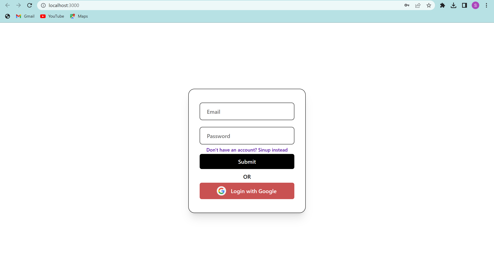
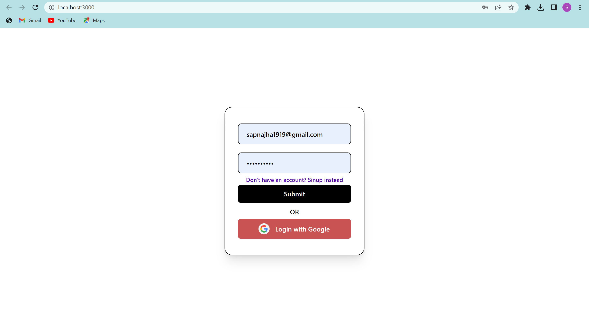
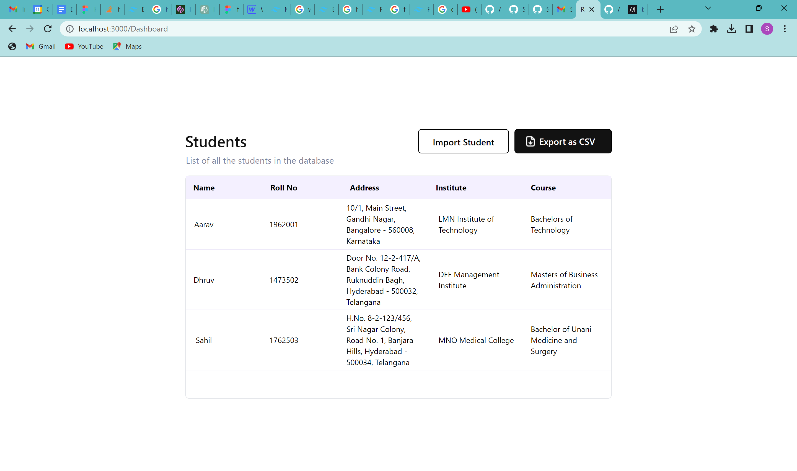
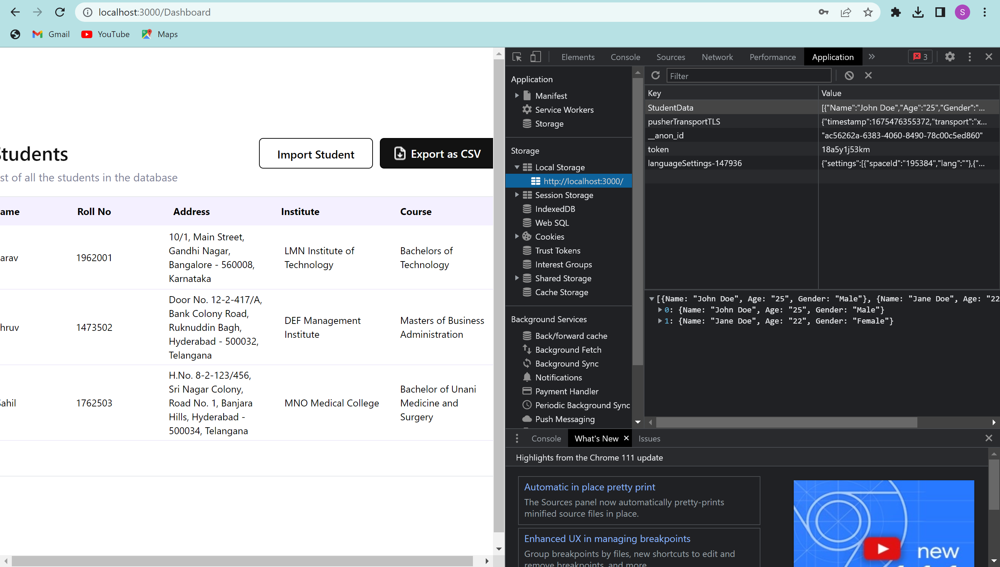
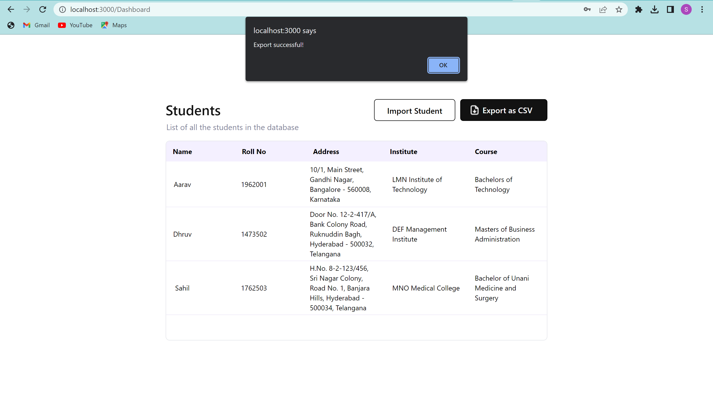

# Student-Dashboard-Manager
This is a React app that allows users to authenticate, access a dashboard panel, and manage student data. The app includes the following features:

* Authentication screen: Users can enter an email and password to access the dashboard panel.
* Dashboard panel: Users can import and export student data using local storage.
  * Import feature: Users can import a CSV file containing a list of students and convert it into a JSON structure. The  JSON data is then saved into local storage with a key of "StudentData".
  * Export feature: Users can download the JSON file containing the student data that is saved in local storage.

## Getting Started
To use this project, follow these steps:

* Install Node.js and npm if they are not already installed on your computer, Recommended node version>=14.
* Clone this repository to your local machine.
* In the project directory, run "npm install" to install the required dependencies.
* To start the app, run "npm start" in the project directory.
* Open your browser and navigate to http://localhost:3000 to view the app.

### Preview
If everything goes well, This login page will be shown in the browser:

It can take any Email address and password for Authentication.
It will look like this:

Click on "Submit" or "Login with Google" to redirect to Dashboard page.
If everything goes well, you will see this page:

#### How to use
After reaching Dashboard page, you can import any csv file to json and save it to the localstorage by clicking on the "Import Student" button. Then you can export that converted Json string to you local storage of browser using "Export as CSV" button.

##### Detailed steps
* Import:
After clicking "Import Student" button.
--> It will open your file manager, select any csv file.
--> It will show an alert indicating successfull import.
Look at the below snapshot for reference:

You can also check if the stringify Json is saved in your local storage by opening the development tools-> Application-> Local storage-> localhost url
There will be a Studentdata key. It will show something like this:

* Export:
-->After successful import, click on the "Export as CSV" button.
It will show a prompt indicating successfull export and the file will be downloaded:
Take reference from this snapshot:

After that it will show the Json file downloading there, open it in any text editor, it will have the stringify Json.

All Done! Thank you for checking out.

