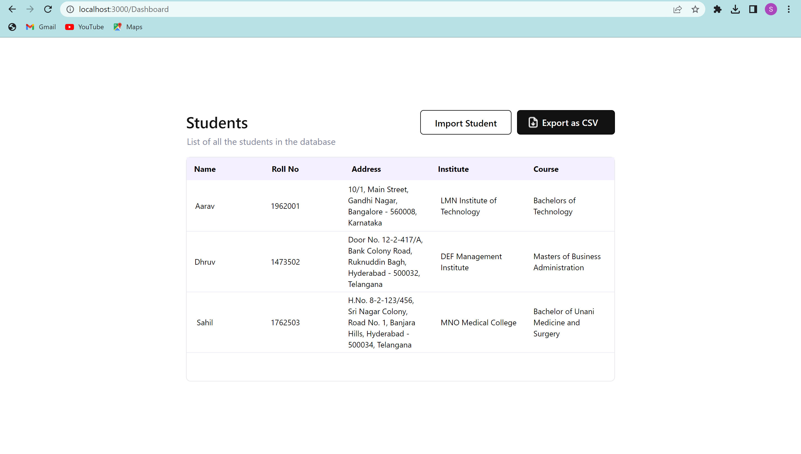

# Student-Dashboard-Manager
This is a React app that allows users to authenticate, access a dashboard panel, and manage student data. The app includes the following features:

* Authentication screen: Users can enter an email and password to access the dashboard panel.
* Dashboard panel: Users can import and export student data using local storage.
  * Import feature: Users can import a CSV file containing a list of students and convert it into a JSON structure. The  JSON data is then saved into local storage with a key of "StudentData".
  * Export feature: Users can download the JSON file containing the student data that is saved in local storage.

## Getting Started
To use this project, follow these steps:

* Install Node.js and npm if they are not already installed on your computer.
* Clone this repository to your local machine.
* In the project directory, run npm install to install the required dependencies.
* To start the app, run npm start in the project directory.
* Open your browser and navigate to http://localhost:3000 to view the app.

### Preview
If evrything goes well, This login page will be shown in the browser:

It can take any Email address and password for Authentication.
It will look like this:

Click on Submit or Login with Google to redirect to Dashboard page.
If everythind done well, you will see this page:

#### How to use
After reaching Dashboard page, you can import a csv file to json and save it to the localstorage by clicking on the "Import Student" button. Then you can export that converted Json string to you local storage of browser.

* Import:
--> It will open your file manager, select any csv file.
--> If everything goes well, you will see an alert indicating successfull import.
Look at the below snapshot for reference:

* Export:
-->After successfull import, click on the export csv button.
You will see a prompt indicating successfull export and your file will be downloaded:
Take reference from this snapshot:

Done! Thank you for checking out.

